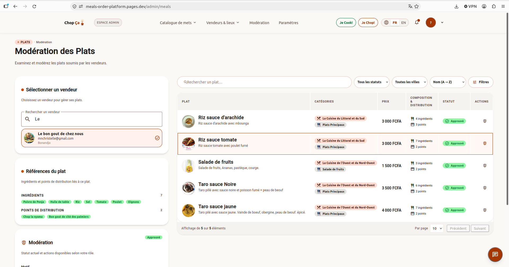

# 🍽️ Multi-Vendor Meal Marketplace

A full-stack platform connecting food vendors (restaurants, caterers, home chefs) with customers, enabling meal discovery, ordering, and scheduled meal planning with multiple payment options.

**🔗 Live demo:** https://meals-order-platform.pages.dev

---

## 🎯 Overview

The Multi-Vendor Meal Marketplace is a platform designed to bridge the gap between food vendors and consumers in Cameroon and beyond.

**Key Differentiator: Scheduled Meal Batches**
Customers can plan meals in advance with recurring menus, specific meals per date, or mixed mode.

**Target Users:**
- **Customers:** Browse, order, schedule meals, rate vendors
- **Vendors:** Manage meals, orders, analytics dashboard
- **Admins:** Monitor vendors, manage platform settings

---

## ✨ Core Features

- **Advanced Search:** Filter by location, category, dietary, exclude allergens
- **One-Time Orders:** Order for immediate or future delivery/pickup
- **Scheduled Batches:** Plan weekly/monthly meals (recurring or custom)
- **Conversational Assistant (MealMate):** Natural-language meal and vendor discovery, grounded in the live catalogue
- **Multiple Payments:** Momo, Orange Money, Visa/Mastercard
- **Ratings:** Rate meals, vendors, and delivery (1-5 stars)
- **Vendor Dashboard:** Track sales, top meals, customer feedback
- **Badges:** Trust badges through admin verification

---

## 📸 Screenshots

### Admin — Meal management


### Admin — Vendor moderation


### Vendor — Meal creation


### Vendor — Registration


### Public — Meal catalogue


### Public — Meal detail


---

## 🛠️ Tech Stack

**Backend:**
- Java 17 + Spring Boot 3.x
- PostgreSQL (Primary DB)
- Spring Cloud Gateway (API Gateway)
- Keycloak (IAM)
- S3-compatible storage (image storage)
- Apache Kafka (event-driven communication)
- Redis (cache)
- LLM tool calling (MealMate conversational agent)

**Frontend:**
- Angular 18+ with standalone components + Tailwind CSS
- NgRx (state management)
- Angular Material (UI components)
- Chart.js (dashboards)
- JsPDF (receipts)

**Build:**
- Gradle multi-project (`:common`, `:gateway`, `:meal-service`, `:payment-service`)

**Infrastructure:**
- Docker Compose (local dev)
- GitHub Actions (CI/CD)
- Deployment: Cloudflare Pages (frontend), Render (backend), Neon (PostgreSQL + S3-compatible storage), managed Keycloak

---

## 🏗️ Architecture

```
                    Angular Frontend
         (Customer UI + Vendor Dashboard + Admin UI
          + MealMate conversational widget)
                              |
                              v
              Spring Cloud API Gateway
              (Redis for rate limiting & caching)
                              |
              -------------------
              |                 |
              v                 v
        Meal Management MS     Payment MS
          - Vendors              - Cart & Checkout
          - Meals                - Payment Gateways
          - Orders               - Invoices
          - Schedules            - Transaction History
          - Ratings
          - MealMate (AI)        |
            |                    |
            v                    v
            Kafka Topic          Kafka Topic
            (OrderCreatedEvent)  (PaymentConfirmedEvent)
            |                    |
            ---------------------
            |
            v
            PostgreSQL
            (meal_db and payment_db)
```

---

## 🤖 MealMate — Conversational Assistant

MealMate is a conversational agent integrated into the marketplace. It lets customers describe what they want in natural language ("quelque chose de léger sans arachide, près de moi") instead of navigating filters.

**How it works:**
- Uses LLM **tool calling** to resolve entities (categories, ingredients, cities, vendors) against the live catalogue.
- **Deterministic guardrails in Java:** visibility rules (moderation status, availability, vendor state), allergen filtering, and identifier resolution are enforced in code the model cannot bypass.
- Emits **structured UI payloads** (meal cards, vendor cards) rendered alongside the textual reply.
- Persists conversation history and supports anonymous-to-authenticated session merging on login.

**Scope note:** MealMate is one capability among many — it augments the filter-based catalogue, it does not replace it. The agent's role is to help customers find meals faster; ordering, payment, and vendor management are separate flows.

---

## 📁 Project Structure

**Backend** — Gradle multi-project.

```
backend/
├── common/                 # Shared constants, enums, exceptions, pagination, validation
├── gateway/                # Spring Cloud API Gateway
├── meal-service/           # Meal Management + MealMate (AI)
│   └── src/main/java/com/mealmarket/
│       ├── meal/           # Meals, vendors, categories, ingredients, cities, locations
│       │   ├── application/       # DTOs, mappers, services, ports
│       │   ├── domain/            # Models, events, repository interfaces
│       │   └── infrastructure/    # Persistence, web, IAM, storage, security
│       └── ai/             # MealMate conversational agent
│           ├── application/       # DTOs, ports (LlmClient, StructuredPayloadManager)
│           ├── domain/            # ChatSession
│           └── infrastructure/    # LLM clients, persistence, tools, web
└── payment-service/        # Payment
└── src/main/resources/db/     # Flyway migrations
```

**Frontend** — Angular standalone components.

```
frontend/chopca/src/app/
├── components/
│   ├── ai/                 # MealMate chat widget + meal/vendor cards
│   ├── auth/               # Login, vendor portal badge, register
│   ├── layout/             # Auth layout, main layout
│   ├── marketplace/
│   │   ├── category/       # Admin CRUD (table, form, filters, icon picker)
│   │   ├── city/           # Admin CRUD
│   │   ├── ingredient/     # Admin CRUD
│   │   ├── location/       # Admin CRUD
│   │   ├── meal/
│   │   │   ├── editor/     # Vendor meal editor (steps, cards, pickers)
│   │   │   └── view/       # Public catalog, detail, cart, checkout
│   │   ├── moderation/     # Moderation panel
│   │   ├── registration/   # Vendor registration flow
│   │   └── vendor/         # Vendor directory, detail, cards
│   ├── pages/              # Route-level pages (auth, marketplace, registration)
│   └── shared/             # Icons, badges, dialogs, form fields, paginator, toast
├── core/
│   ├── guards/             # Route guards
│   ├── interceptor/        # HTTP interceptors (auth, language)
│   ├── models/             # Typed API contracts (ai, auth, marketplace, shared)
│   ├── services/           # HTTP services (ai, auth, marketplace, session)
│   └── storage/            # AppSessionStore
└── mock/                   # Mock data + services for local dev
```

---

## 🚀 Quick Start

**1. Clone the repository:**
```bash
git clone https://github.com/your-org/meal-marketplace.git
cd meal-marketplace
```

**2. Start infrastructure with Docker Compose:**
```bash
docker-compose -f backend/docker-compose.dev.yml up -d
```

**3. Start backend services (from `backend/`):**
```bash
./gradlew :meal-service:bootRun
./gradlew :payment-service:bootRun
./gradlew :gateway:bootRun
```

**4. Start frontend:**
```bash
cd frontend/chopca
npm install
ng serve
```

**Access URLs:**
- Frontend: http://localhost:4200
- Admin UI: http://localhost:4200/admin
- API Gateway: http://localhost:8080
- Swagger UI: http://localhost:8080/swagger-ui

---

## 📚 Documentation

**Platform:**
- [Requirements](./docs/REQUIREMENTS.md)
- [Architecture](./docs/ARCHITECTURE.md)
- [API Contract](./docs/API_CONTRACT.md)
- [Deployment Guide](./docs/DEPLOYMENT.md)

**MealMate (AI module):**
- [Requirements](./docs/mealmate/requirements.md)
- [Architecture](./docs/mealmate/architecture.md)
- [API Contract](./docs/mealmate/api-contract.md)

---

## 📞 Contact

- **Email:** mnchristelle@gmail.com
- **Issues:** GitHub Issues

---

Built with ❤️ for the Cameroonian food community
```
